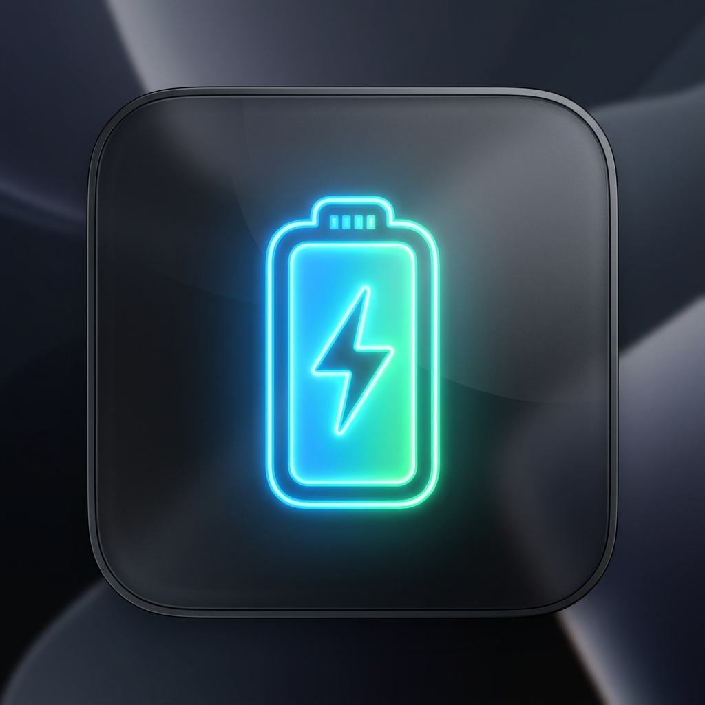
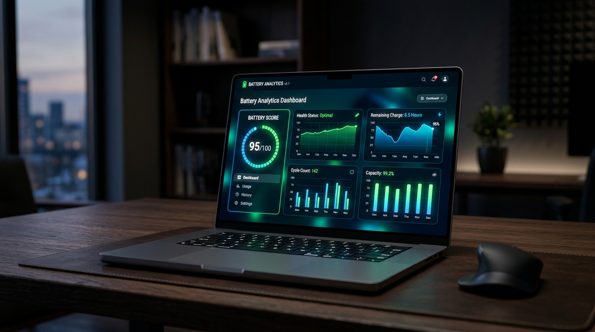
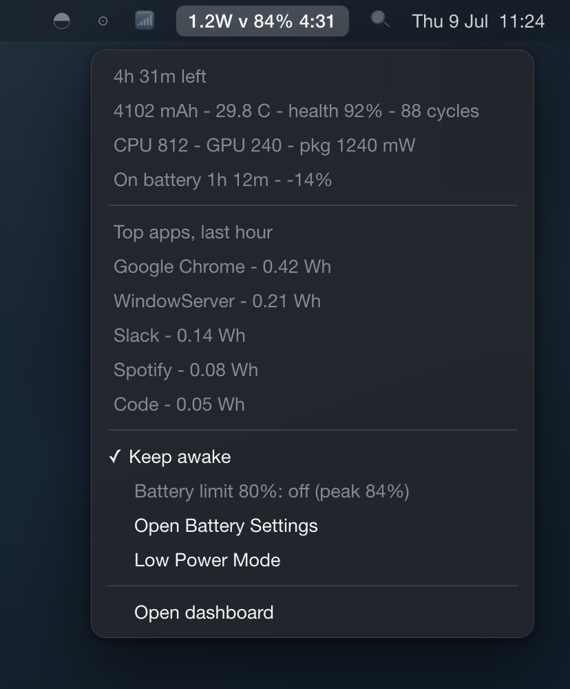

<div align="center">
  
  <h1>Batmon</h1>
  <p><b>The ultimate macOS battery monitor, health tracker, and energy optimizer.</b></p>
  <p>
    
    
    
    
    
    
  </p>
</div>

> Discover exactly what is draining your MacBook's battery, track long-term health degradation, and extend your battery lifespan with intelligent charging advice.

<p align="center">
  
</p>

---

## The Problem

macOS tells you the battery percentage and occasionally gives a vague "using significant energy" warning in Activity Monitor. But what if you want to know:
- **Why did my battery drain 20% while my MacBook was asleep?**
- **Which specific app is secretly eating my battery right now?**
- **Is my 80% charge limit actually working?**
- **How many more cycles does my battery realistically have before it dies?**
- **Is my MacBook overheating while charging?**

## Enter Batmon

**Batmon** is a native battery and power monitor built exclusively for Apple Silicon Macs. It runs 100% locally on your machine—no cloud, no accounts, no telemetry—and provides you with real numbers, actionable advice, and a stunning dashboard to tame your energy usage.

> **Target:** MacBook Pro / Air / Mac (M-series / Apple Silicon), macOS 13.x or newer. Apple Silicon only.

---

## 🔥 Features That Make a Difference

### 🧠 Smart Battery Advisor & Score (NEW!)
Batmon doesn't just show data; it acts as your personal battery health coach.
- **Battery Score (0-100):** A comprehensive grade based on your charging habits, temperatures, and deep discharges.
- **Actionable Recommendations:** Get warned if you're parking your battery at 100% for too long, experiencing frequent deep discharges, or charging hot.
- **Health Forecast:** A predictive linear model that forecasts your battery's health 1 and 2 years into the future based on your actual wear.
- **Printable Weekly Reports:** Generate beautiful PDF reports summarizing your energy usage, top apps, and charging habits.

### 🕵️ Sleep Drain & Dark Wake Detection
Stop wondering what happened overnight. Batmon records abnormal charge loss across sleep gaps and pinpoints the exact processes (like `powerd` or `Bluetooth`) that woke or held the machine awake.

### 🔪 App Energy Attribution & Taming
- **Vague Activity Monitor? No more.** See the actual **Watt-hours** and **Watts** drawn by every process.
- **1-Click Taming:** Hover over any app in the Top Apps table to pause (SIGSTOP), resume, or kill a runaway battery-hog directly from the dashboard.

### ⚡ Live Component Power & Thermals
Geek out on hardware with a real-time dashboard that refreshes every 5 seconds:
- **Live Wattage Draw:** See exact power consumption for the CPU, GPU, Apple Neural Engine (ANE), and the total package (SoC).
- **Temperatures:** Monitor SoC, SSD, and Battery temperatures in real-time. Heat kills batteries—stay informed.

### ⚠️ Smart Anomalies & Notifications
Get notified natively through the macOS menu bar for edge cases that ruin battery life:
- **Hot Charging:** Warns you if the battery averages >38°C while charging.
- **Held at 100%:** Warns you if the battery sits at 100% on AC for hours (the main aging driver).
- **Weak Charger:** You're plugged in, but the battery is still draining!
- **High Thermal Pressure** and **Per-App Energy Spikes.**

### 🚀 Menu Bar App & Keep-Awake
<p align="center">
  
</p>
<p align="center"><em>The native menu bar app: watts, charge, and forecast at a glance; the full readout one click away.</em></p>

- **Native Menu Bar App:** Live watts, charge %, and forecast at a glance. Completely silent to EDR tools (no subprocess forks).
- **Keep-Awake Toggle:** One switch prevents your Mac from sleeping—perfect for long downloads or keeping corporate VPNs alive without leaving the app.

---

## 🏗 Architecture

Three small processes share one local SQLite database (WAL mode). The daemon is the only writer; everything else reads.

| Process | Runs as | Role |
| --- | --- | --- |
| **batmond** | root LaunchDaemon | The only database writer. Samples `ioreg` (battery, every 15s), `powermetrics` (a short burst per minute for component and per-app power), display brightness, and sleep assertions. Computes sessions, rollups, the discharge forecast, and anomalies. Accepts no network or socket input. |
| **batmon-web** | user LaunchAgent | FastAPI service on `127.0.0.1:8899`, serving the dashboard and JSON API. Opens the database **read-only**. Owns the optional `caffeinate` child for the Keep-awake toggle. |
| **Menu-bar app** (`ui/batmon_menu.py`) | user LaunchAgent | Native macOS menu bar app via `rumps`. Reads `/api/now`, gracefully handles API unavailability. Delivers native anomaly notifications (`NSUserNotification`). |

Data lives in `/usr/local/var/batmon/batmon.db`. Raw samples are kept 48 hours, hourly rollups 90 days, and daily rollups indefinitely, so long-term trends stay cheap to store.

---

## 🛠 Installation

Batmon installs with a single script. It requires an Apple Silicon Mac and system `python3`. There is no Homebrew or third-party dependency for the core install.

```bash
# You will be prompted for your password to register the root daemon
./install.sh
```

That's it. The daemon starts collecting immediately, and the native menu bar app will appear at the top of your screen. 
Access the gorgeous dashboard at: **http://127.0.0.1:8899**

### Uninstall
```bash
./uninstall.sh            # remove batmon, keep your historical data
./uninstall.sh --purge    # remove batmon and delete the database entirely
```

---

## 💻 Usage & Tabs

Open **http://127.0.0.1:8899** and explore:
- **Now:** Live power, forecast, component breakdown, top apps (with pause/resume/kill), session, and connected devices.
- **Advisor:** Your personalized Battery Score, recommendations, and habit analysis.
- **Report:** A weekly printable PDF summary of your usage.
- **History:** Charge %, watts, and component power over 24h / 7d / 30d.
- **Apps:** Per-app energy over 1h through 30d; toggle system processes on/off.
- **Energy:** Discharged vs charged watt-hours with brightness overlay.
- **Health:** Capacity, cycles, cell balance, lifetime temps, and trend forecasts.
- **Charging:** Sessions, time on battery vs AC, and discharge-depth histogram.
- **Anomalies:** The full anomaly log for deep investigations.

---

## 🛡 Privacy and Non-Goals

- **100% Local.** No analytics, no tracking, no cloud, no account. Every sample stays in a SQLite file on your Mac.
- **No remote access.** The web service binds to `127.0.0.1` only. 
- **Least privilege.** The root daemon opens no network sockets and never runs from your writable project folder - only from a root-owned directory. It runs no arbitrary input and executes fixed Apple binaries with fixed arguments.
- **Not in scope:** Intel Macs, remote monitoring, and websockets.

---

<p align="center">
  <i>Take back control of your MacBook's battery life today.</i>
</p>
