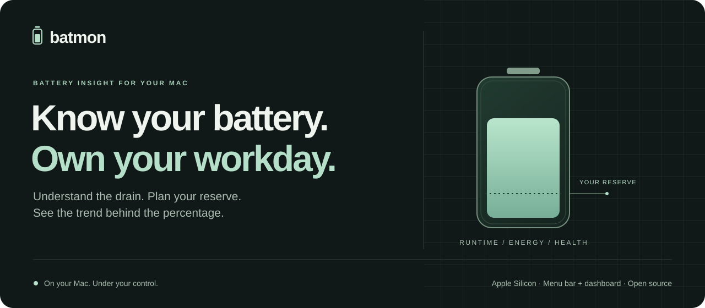

<p align="center">
  
</p>

<h1 align="center">Your battery percentage has a backstory.</h1>

<p align="center">
  <strong>Find the activity behind the drain. Plan your time away from a charger.<br>Understand how your MacBook's battery changes over time.</strong>
</p>

<p align="center">
  A native menu bar companion and a detailed local dashboard for Apple Silicon MacBooks.<br>
  No account. No cloud service. No subscription.
</p>

<p align="center">
  <a href="#install">Install batmon</a> ·
  <a href="#a-better-answer-to-three-everyday-questions">Explore the features</a> ·
  <a href="#private-by-design">Privacy</a> ·
  <a href="LICENSE">GPL-3.0</a>
</p>

---

## A better answer to three everyday questions

### "Will I make it through the next meeting?"

Choose a **10%, 20% or 30% reserve**, set how long you need to keep going, and compare your goal with a runtime range based on recent battery use. Keep charge and power in your menu bar; open the dashboard when you want the full picture.

The estimate adapts to your recent load. It pauses on AC and waits for enough continuous battery readings before making a prediction.

### "What is keeping my Mac busy?"

Explore a searchable app activity ranking, CPU/GPU/Neural Engine power, and charge history on a shared timeline. In the recent 24-hour view, filter app estimates by **battery or AC** to see how the picture changes away from your desk.

Then try one change. The Advisor walks you through a **before/after experiment**, checks measurement coverage and brightness, and compares observed power under the conditions you control.

### "Is this a busy week, or a battery problem?"

See the **macOS battery assessment** alongside raw capacity trends, weekly medians and cycle history. Review time spent at higher charge levels, recurring events and changes between equal **7-day or 30-day windows**.

The Health view also checks short-term capacity predictions against later historical readings. You can see how well a model performed before putting weight on its forecast.

> **Useful numbers, with their meaning attached.** App energy is an estimate of chip activity, not a direct measurement of an app's share of the whole battery. Missing readings stay unknown. An unreliable long-term forecast stays withheld.

## Small in the menu bar. Detailed when you need it.

Nine focused views take you from a quick glance to a deeper investigation.

| View | What you can do |
| :--- | :--- |
| **Now** | Check charge, power, available sensors, your reserve and runtime goal. |
| **Advisor** | Choose autonomy or battery care, track completed actions and compare a change. |
| **History** | Align charge, power and temperature with a shared cursor, including keyboard control. |
| **Apps** | Search estimated chip-energy rankings and explore recent battery/AC differences. |
| **Energy** | Compare energy in and out, daily usage and how much time was actually observed. |
| **Health** | Separate macOS health from raw sensor trends; inspect shifts and forecast accuracy. |
| **Charging** | Review charging and holding periods, charge-level exposure and low-charge episodes. |
| **Anomalies** | Group recurring observations, inspect their evidence and acknowledge what you reviewed. |
| **Report** | Compare weeks or months, export JSON/CSV, or print through your browser. |

A **Keep awake** switch is there for long-running work. It prevents idle sleep while leaving lid-close and manual sleep behavior intact. Native charge-limit status appears when macOS exposes it; Battery settings are one click away.

## Install

**Built for Apple Silicon MacBooks.** Verified on a MacBook Pro M4 Pro running macOS 26.5. Other Apple Silicon/macOS combinations may expose different sensors and have not all been validated. Intel Macs are not supported.

You need Git, a working `python3` with `venv` and `pip`, and Apple's Command Line Tools Python at `/usr/bin/python3` for the collector. If Command Line Tools are missing, run `xcode-select --install` and finish Apple's installer first.

```bash
git clone https://github.com/m1l0rdz/batmon.git
cd batmon
./install.sh
```

Run the installer as your normal user. It requests administrator access for the system collector, installs Python dependencies in a local virtual environment, and starts the collector, web service and menu bar app.

**Open [127.0.0.1:8899](http://127.0.0.1:8899/) and you're in.** Keep the cloned folder in place: the web service and menu bar app run from it.

### Your first few minutes

1. **Open Now.** Check the first readings and choose your reserve.
2. **Use your Mac normally.** A runtime range needs at least five minutes of continuous, usable battery observations.
3. **Explore Apps and History.** Longer-range summaries appear after completed collection hours; health trends build with daily readings.
4. **Return to Report.** Compare your own usage over time, with collection coverage shown beside the totals.

<details>
<summary><strong>Updating and uninstalling</strong></summary>

To update an unmodified checkout, pull the latest code and rerun the installer. Your history stays in the local database.

```bash
git pull --ff-only
./install.sh
```

To remove the background services and installed collector while keeping your history:

```bash
./uninstall.sh
```

To also **permanently delete the collected history**, use `./uninstall.sh --purge` instead. The cloned project folder and its virtual environment remain in place.

</details>

## Private by design

Your battery history belongs on your Mac.

- **Local storage.** Measurements stay in SQLite. There is no account, cloud backend or usage analytics service.
- **Local access.** The dashboard listens on `127.0.0.1`, not your network interface. Its scripts, charts and fonts need no CDN.
- **A narrow collector.** The privileged process uses macOS tools and opens no network sockets. The dashboard reads the database without writing to it.
- **Your choices stay yours.** Goals, the action journal and event acknowledgements are stored in your browser. They do not silently change macOS settings.

Installation downloads Python dependencies. Optional guidance links open external websites; collected telemetry is not uploaded by batmon.

<details>
<summary><strong>How the measurements work</strong></summary>

| Signal | Collection and scope |
| :--- | :--- |
| Battery charge, current and voltage | `ioreg` readings approximately every 15 seconds. |
| Chip and app activity | A short `powermetrics` sample each minute; app energy is allocated from relative Energy Impact. |
| Battery condition | The macOS assessment, shown separately from the raw capacity/design ratio. |
| History | Raw samples for 48 hours, hourly summaries for 90 days, daily summaries retained indefinitely. |

Recent app source filters use estimated time alignment. Historical app summaries combine AC and battery. Chip and battery readings have different sampling intervals, so their difference cannot identify display, Wi-Fi or SSD consumption.

The habits score describes available charging observations, not battery health or remaining lifespan. Before/after comparisons are observational; workload and other unmeasured conditions can still explain a change.

Data is stored at `/usr/local/var/batmon/batmon.db`. The stack is Python, FastAPI, SQLite, a native `rumps` menu bar app and a vanilla JavaScript dashboard with bundled Chart.js.

</details>

<details>
<summary><strong>If a reading or export is unavailable</strong></summary>

- **Missing temperature or charge limit:** sensor and policy availability varies with macOS and hardware. Unavailable values are not treated as zero.
- **No runtime yet:** use battery power and allow at least five uninterrupted minutes of usable observations. Sleep gaps or a change of power source restart the window.
- **No long-term forecast:** enough stable history is required. An observed trend can still be shown without extrapolating it into a replacement date.
- **An embedded browser does not download:** JSON and CSV exports include a readable preview and a Copy data button. For Print / Save as PDF, use a browser that supports printing, such as Safari or Chrome.
- **Dashboard does not open:** check `/tmp/batmon-web.log` and `/usr/local/var/batmon/batmond.out.log`, then report the error with your Mac model and macOS version. Review logs before sharing them.

</details>

---

<p align="center">
  <strong>Make your next battery decision with a little more clarity.</strong><br>
  <a href="#install">Install batmon</a> ·
  <a href="https://github.com/m1l0rdz/batmon/issues">Report an issue</a> ·
  <a href="LICENSE">Read the license</a>
</p>
